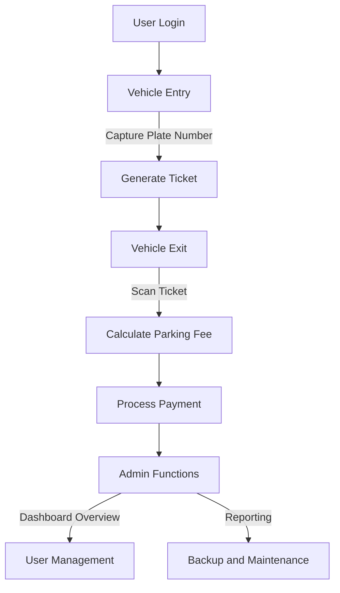

# Flow Diagram for Parking Management Application

```mermaid
flowchart TD
    A[User Login] --> B[Vehicle Entry]
    B -->|Capture Plate Number| C[Generate Ticket]
    C --> D[Vehicle Exit]
    D -->|Scan Ticket| E[Calculate Parking Fee]
    E --> F[Process Payment]
    F --> G[Admin Functions]
    G -->|Dashboard Overview| H[User Management]
    G -->|Reporting| I[Backup and Maintenance]
```
